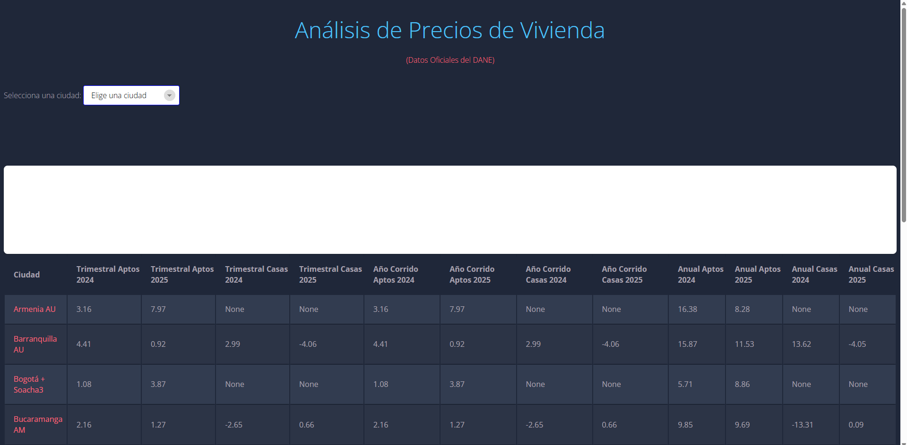
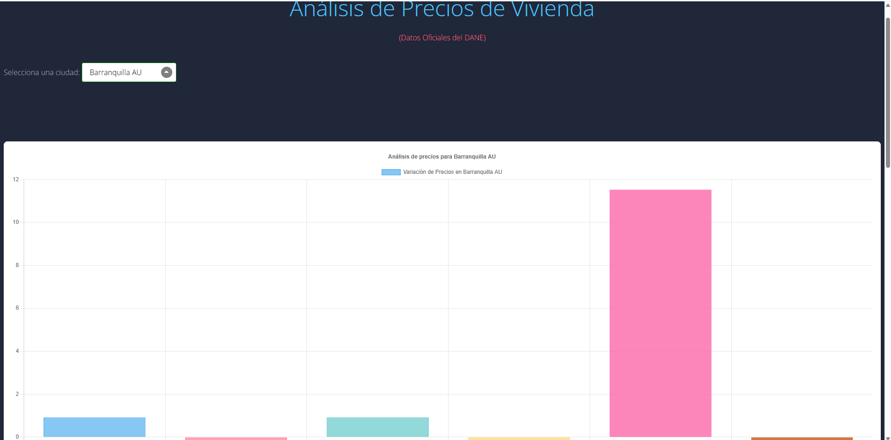

# 📈 Dashboard de Precios de Vivienda Nueva en Colombia (DANE)

Una aplicación web interactiva para procesar, analizar y visualizar el **Índice de Precios de Vivienda Nueva (IPVN)** publicado por el DANE.  
El proyecto incluye un backend con una **API RESTful** construida en Flask y un frontend dinámico con JavaScript y Chart.js, permitiendo explorar y comparar indicadores de vivienda por ciudad.

---

## 🚀 Demo en Vivo & Captura de Pantalla

> [🔗 **Ver Demo en Vivo**](https://ipvn-colombia-dashboard-api.onrender.com/)  


>   

>   


---

## ⭐ Características Principales

- **Procesamiento de Datos Eficiente:**  
  Carga y limpieza de archivos Excel complejos del DANE usando Pandas.

- **API RESTful Robusta:**  
  Backend en Flask con endpoints claros para servir los datos en formato JSON.

- **Frontend Interactivo:**  
  Dashboard dinámico con JavaScript puro, que consume la API y actualiza gráficos/tablas en tiempo real.

- **Visualización Clara:**  
  Gráficos de barras con Chart.js para comparar indicadores entre ciudades y tipos de vivienda.

- **Arquitectura Cliente-Servidor:**  
  Separación profesional entre backend (lógica y datos) y frontend (presentación).

---

## 💻 Tecnologías Utilizadas

**Backend:**
- Python 3
- Flask
- Pandas

**Frontend:**
- HTML5, CSS3
- JavaScript (ES6)
- Chart.js

**Análisis de Datos:**
- Pandas

---

## ⚡ Instalación y Uso

Sigue estos pasos para ejecutar el proyecto en tu máquina local:

### Prerrequisitos
- Python 3 o superior

### 1. Clona el Repositorio

```bash
git clone https://github.com/cristian6513/IPVN-Colombia-Dashboard-API.git
cd IPVN-Colombia-Dashboard-API
```

### 2. Crea un Entorno Virtual

```bash
python -m venv venv
# En Windows
venv\Scriptsctivate
# En macOS/Linux
source venv/bin/activate
```

### 3. Instala las Dependencias

```bash
pip install -r requirements.txt
```

### 4. Coloca el Archivo de Datos

Asegúrate de que el archivo `anex-IPVN-Itrim2025.xlsx` esté en la misma carpeta que `app.py`.

### 5. Ejecuta la Aplicación

```bash
flask run
# o también
python app.py
```

Abre tu navegador en [http://127.0.0.1:5000](http://127.0.0.1:5000)

---

## 📖 Endpoints de la API

### `GET /ciudades`
Devuelve una lista de todas las ciudades disponibles en el dataset.

**Respuesta:**
```json
{
  "ciudad": ["Armenia AU", "Barranquilla AU", "Bogotá+Soacha3", ...]
}
```

---

### `GET /filtro?Ciudad=<nombre_ciudad>`
Devuelve todos los datos numéricos para una ciudad específica.

**Parámetros:**  
- `Ciudad` (string): Nombre de la ciudad (ej. "Cali AU")

**Respuesta:**
```json
[
  {
    "Ciudad": "Cali AU",
    "Trimestral_Aptos_2025": 6.54,
    "Trimestral_Casas_2025": 8.13,
    ...
  }
]
```

---


## 📧 Contacto

- **Cristian Betancourt**
- [LinkedIn](https://www.linkedin.com/in/cristian-betancourt-barbosa-cjbb13/)
- cb3013905@gmail.com

---

**Fuente de datos:**  
[IPVN - DANE](https://www.dane.gov.co/index.php/estadisticas-por-tema/precios-y-costos/indice-de-precios-de-la-vivienda-nueva-ipvn)  
*Este proyecto es un desarrollo personal y no está afiliado oficialmente al DANE.*
